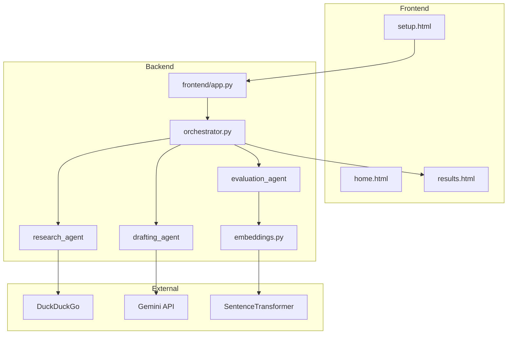

# GrantAI

**Proof of concept** — AI-assisted grant discovery, semantic fit ranking, and proposal drafting for NGOs, student teams, and small organizations.

> Fit scores are **similarity estimates**, not legal eligibility. Always verify grants on official sites before applying.

## Problem

Grant seekers spend 10–20+ hours per cycle searching portals, reading eligibility pages, and rewriting narratives. Information is fragmented and first drafts are slow to produce.

## Solution (this POC)

GrantAI runs a three-step pipeline:

1. **Research** — Search the web (DuckDuckGo) for funding opportunities matching your project.
2. **Rank** — Score each result by semantic similarity (Sentence Transformers) to your description.
3. **Draft** — Generate an eight-section proposal draft (Google Gemini) using your context and top matches.

## User flow

```
Home → Search form → [pipeline runs] → Results (grants + metrics + proposal)
```

See [examples/water_ngo_rajasthan.md](examples/water_ngo_rajasthan.md) for a sample input.

## Architecture



## Tech stack

- Python, Flask
- DuckDuckGo Search
- Sentence Transformers + scikit-learn (fit ranking)
- Google Gemini API (proposal drafting)

## Setup

```bash
python -m venv .venv
.venv\Scripts\activate          # Windows
# source .venv/bin/activate     # macOS/Linux

pip install -r requirements.txt
cp .env.example .env            # then add your GEMINI_API_KEY
python app.py
```

Open [http://127.0.0.1:5000](http://127.0.0.1:5000).

### Environment variables

| Variable | Required | Description |
|----------|----------|-------------|
| `GEMINI_API_KEY` | Yes | Google Gemini API key for drafting |
| `FLASK_SECRET_KEY` | No | Session secret (defaults to dev value) |

### Troubleshooting

| Issue | Fix |
|-------|-----|
| First search is slow (~30s) | Embedding model loads on first rank step (lazy load) |
| No proposal generated | Set `GEMINI_API_KEY` in `.env` |
| Gemini quota / model errors | Check [Google AI Studio](https://aistudio.google.com) |
| Empty grant list | Try broader domain keywords or check network |

## Project structure

```
Grant-AI-agent/
├── app.py                 # Entry point
├── backend/
│   ├── orchestrator.py    # Pipeline coordinator
│   ├── agents/            # research, evaluation, drafting
│   └── utils/embeddings.py
├── frontend/
│   ├── app.py             # Flask routes
│   ├── templates/
│   └── static/
├── examples/              # Sample use cases
└── requirements.txt
```

## Limitations (honest POC scope)

- Web search results are **not** a curated grant database.
- Deadlines and amounts are placeholders unless parsed from source pages.
- Fit % = semantic similarity, **not** rule-based eligibility.
- No user accounts, saved history (session only), or auto-submit.
- Proposal output requires human review and editing.

## Roadmap

- [ ] Fetch grant pages and extract structured deadline / eligibility fields
- [ ] Async jobs + real progress streaming
- [ ] PDF/DOCX export
- [ ] Official grant APIs (Grants.gov, etc.)
- [ ] Saved projects and org profiles

## License

Add a license file before open-sourcing (e.g. MIT).
